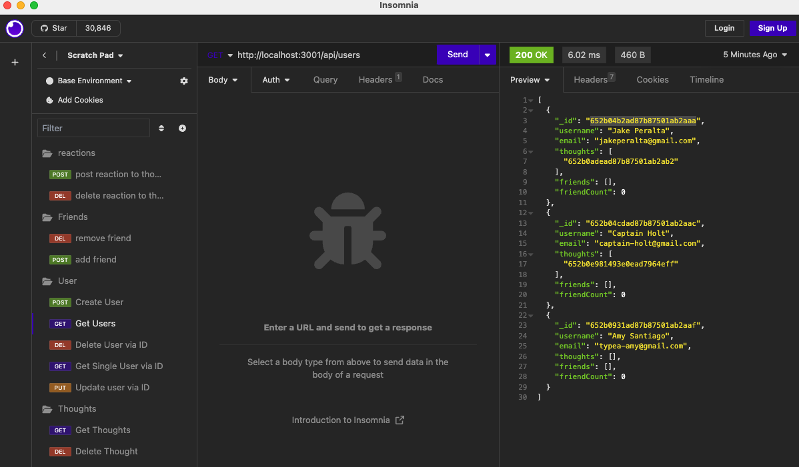

# Social Network API
an API for a social network web application where users can share their thoughts, react to friends’ thoughts, and create a friend list

## Walk Through 
https://drive.google.com/file/d/1kamHrf8ePTdk2R8FN760Rg-g3pUSLmIE/view

## Table of Contents
- [Table of Contents](#table-of-contents)
- [Description](#description)
- [Usage](#usage)
- [Mock Image](#mock-image)
- [Installation](#installation)
- [License](#license)
- [Contributors](#contributors)
- [Tests](#tests)
- [Questions](#questions)

## Description
As a social media startup, I have created API for my social network that uses a NoSQL database to allow my website to handle large amounts of unstructured data. Users of this platform can add/remove friends, post thoughts and recieve reactions. 

## Mock Image

## Usage 
This application uses Insomnia to test routes (GET/POST/PUT/DELETE)
- `http://localhost:3001/api/thoughts` to GET all thoughts
- `http://localhost:3001/api/thoughts` to POST thoughts, body must contain 
    - { 
	"thoughtText": "hi",
	"username": "{username}",
	"userId": "{userID}" }
- `http://localhost:3001/api/thoughts/thoughtID` to DELETE and PUT (body must include {"thoughtText": {updatedtext}}) a thought
- `http://localhost:3001/api/users` to GET all users, to create (POST) a user, add a body with {"username":[], "{email}": []}
- `http://localhost:3001/api/users/:userId` to DELETE or PUT user by ID. 
- `http://localhost:3001/api/users/:userId/friends/:friendId` to add/remove friends 
- `http://localhost:3001/api/thoughts/:thoughtId/reactions` to POST reaction, body should include 
    - { 
	"reactionBody": "insert reaction here",
	"username": "{username}",
	"userId": "{userID associated with it}" }
- `http://localhost:3001/api/thoughts/:thoughtId/reactions/:reactionId` to DELETE reaction

## Installation 
The user must clone the repository onto their local drive. Install dependencies using `npm i` and start using `npm run start`

## License 
This project is covered under the MIT license.

## Contributors
I am the sole contributor of this project. However, this project was built with the help of in class modules, specifically the Student Mini Project. Additional links that were helpful linked below: 
https://www.educative.io/answers/what-is-select-in-mongoose
https://mongoosejs.com/docs/tutorials/virtuals.html

## Tests 
N/A

## Questions 
For any additional questions or information, please contact me, additionally, feel free to view my other projects: 
- Github: [shaffachaudhry](https://github.com/shaffachaudhry)
